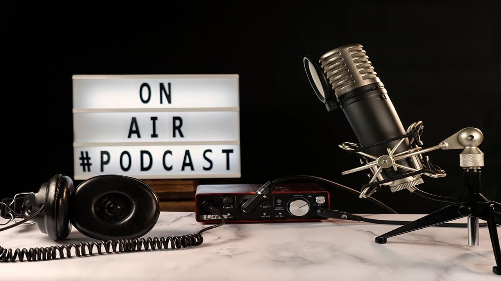

# Leitfaden zum Erstellen eines Podcasts als Prüfungsleistung

(Bildquelle: https://www.btb-lax.com/blog/Podcasts)

## Grundformen und Besonderheiten philosophischer Podcasts

Um die Wege nachzuzeichnen, die bei der Erstellung philosophisch akademischer Podcasts beschritten werden können, kann das breite Feld der Podcast-Landschaft zunächst auf formaler Ebene eingegrenzt und unterschieden werden. Professionell produzierte und zur Veröffentlichung bestimmte Podcasts lassen sich zunächst in zwei Grundformen von Rundfunkbeiträgen unterscheiden: Gesprächsbeiträge und gebaute Beiträge. Diese formale Unterscheidung zielt primär auf die Ebene der Produktionsbedingungen und -methoden. In Gesprächsbeiträgen – der wohl am häufigsten vertretenen Form – gibt es meist eine:n Moderator:in und eine:n Gast:in oder Gäste, die ein Gespräch führen. In aller Regel konzentriert sich dieses Gespräch auf ein einziges Thema, das diskutiert oder erörtert wird.

Gegenüber den Gesprächsbeiträgen stehen sogenannte gebaute Beiträge, welche die Standardeinheit des Hörfunks bilden. Diese Grundform bietet sich für eine breite Palette von Podcast-Produktionen an. Bei gebauten Beiträgen findet in der Herstellung eine ähnliche Mosaikarbeit statt, wie sie auch bei Gesprächsbeiträgen nötig ist. Der wesentliche Unterschied liegt darin, dass nicht die Aufnahme eines Gesprächs die Grundlage bildet, sondern eine Art Drehbuch, in dem alle Elemente, die sich für die Audio-Form anbieten und den Produzent:innen zur Verfügung stehen, verwendet werden können. Potenziell unterschiedlichste Inhalte werden bei der Herstellung gebauter Beiträge zu einem neuen, kohärenten Ganzen. Alle Teile und ihre Zusammenfügung dienen hier dem Ziel, eine – im weiten Sinne des Begriffs – Geschichte zu erzählen und Gedankengänge systematisch zu entfalten

Die Beispiele für gebaute Beiträge sind mannigfaltig: Reportagen, Rezensionen, Kommentare, Features oder Hörspiele gehören dazu. Bei gebauten Beiträgen sind der Fantasie und den Gestaltungsmöglichkeiten kaum Grenzen gesetzt. Mögliche Elemente, die ihren Weg in das fertige Produkt finden können, sind unter anderem eingesprochene, auch schauspielerisch dargebotene Texte, Musik, Soundeffekte, Interviewausschnitte (sog. O-Töne), Atmosphärengeräusche oder auch Snippets aus anderen Medieninhalten, etwa Nachrichtensendungen oder Filmen.

Podcasts, die sich philosophisch nennen wollen, sind mit bestimmten Anforderungen konfrontiert, denen sich viele andere Podcasts nicht stellen müssen. Darüber hinaus bietet der philosophische Podcast gestalterische Möglichkeiten, die anderen Podcasts verschlossen bleiben – das Eigentümliche des Philosophischen birgt in Bezug auf den Podcast das Potenzial für eine spezielle Synthese von Form und Inhalt.

Ein philosophischer Podcast muss sich genuin philosophisch mit einem Thema beschäftigen. In aller Regel sind diese Ideen oder philosophischen Betrachtungen textlich hinterlegt. In dieser Hinsicht ist es kein Wunder, dass eine erfolgreiche Grundform des seriellen philosophischen Podcasts sich in jeder Folge auf einen oder mehrere philosophische Texte konzentriert, die besprochen und kritisch hinterfragt werden. Als einer der weltweit am meisten gehörten Podcasts sei hier „The Partially Examined Life“ genannt.  Die Beschäftigung mit dem Gegenstand sollte in jedem Fall den Gütekriterien guter philosophischer Praxis gerecht werden.

Diese Anforderung ernst nehmend sind nichtsdestotrotz unterschiedlichste Gestaltungsformen für philosophische Podcasts möglich. Im folgenden Abschnitt soll dieses große Feld dargestellt und verschiedene Grundformen philosophischer Podcasts mit Hinblick auf die Eignung für die Lehre im Fach Philosophie voneinander unterschieden werden.

### Ideengeschichtliche Referatspodcast

In die Gruppe der ideengeschichtlichen Podcasts würden auch nicht wenige studentische Referate fallen. In der Universität gibt es durchaus Referatsformen, die diesem Format sehr ähneln.

Das Format Podcast als Substitut für das herkömmliche Format von Referaten in die Lehre zu integrieren, kann besonders gut gelingen, wenn das vorgegebene Thema des Podcasts etwa Zusatztexte sind, die in der Seminarplanung trotz ihrer Eignung vorerst nicht berücksichtigt werden konnten. Auch Exkurse oder Sidenotes, für welche die eigentlichen Seminarinhalte relevant sind und die wiederum das Seminar durch zusätzliche Perspektiven bereichern, können für die Prüflinge und das Seminar lohnenswerte Wege darstellen.

### Interview

Neben ideengeschichtlichen Podcasts sind außerdem Expert:innengespräche bzw. Interviews relevante Formate, bei denen die Wissensvermittlung häufig im Mittelpunkt steht. Hier gibt es einige erfolgreiche, serielle Produktionen wie etwa „In Our Time: Philosophy“ mit Melvyn Bragg oder der Ethik-Podcast „Hinterfragt“ von Andreas Cassee und Anna Goppel an der Uni Basel. Das aufgezeichnete Gespräch ist bei dieser Form in aller Regel nicht gescripted – Interviewfragen selbstverständlich ausgenommen. Expert:innengespräche bieten viele Gestaltungsmöglichkeiten. Das Gespräch steht im Mittelpunkt, aber ob und wie es eingeleitet wird, wieviel und was man schneidet und welchen Charakter das Gespräch überhaupt hat, muss von den Produzent:innen bewusst entschieden werden. Der Aspekt der Planung ist bei dieser Form nicht zu unterschätzen. Die Produzent:innen bestimmen das Gespräch mit der Vorbereitung der Fragen und der Moderation in einem erheblichen Maße.

Das Editing nach der Aufzeichnung ist bei Interviews auf keinen Fall zu vergessen. Die Produzent:innen bemühen sich um ein straffes Gespräch, in dessen Fluss die Dramaturgie gut zum Vorschein kommt. Expert:innengespräche als Podcast würden sich in dieser Hinsicht durchaus auch als Prüfungsleistung im Fach Philosophie anbieten, auch wenn natürlich hiermit eine Form gewählt wäre, bei der der Großteil des gesprochenen Wortes *nicht* vom Prüfling beigesteuert wird.

### Audioessay

Es gibt aber auch philosophische Podcasts, bei denen die Vermittlung von bestehendem Wissen nicht die entscheidende Rolle spielt. Insbesondere für die akademische Philosophie zu empfehlen ist hier der Audioessay. Es ist auf die besondere Verbundenheit von Podcast und philosophischem Essay zu verweisen, die sich gerade aus dem explorativen Arbeiten an dieser Form-Inhalt-Synthese entwickelt.

Als gebauter Beitrag lädt der Audioessay nicht nur die Hörer:innen ein, einer oder mehrerer Gedankenspuren zu folgen. Er erfüllt seine inhaltlich erschließende Funktion darüber hinaus gegebenenfalls auch schon in der Herstellung, wenn die Planung des Beitrags der Reise gleicht, auf die die Hörer:innen später geschickt werden. Das Tastende des philosophischen Essays, das im Kanon der herkömmlichen akademischen Textsorten so einzigartig ist, kann sich in der Form des Podcasts auf eine besondere Weise entfalten. Der prozessuale Charakter des philosophischen Essays, so wird häufig herausgestellt, gleicht dem Gespräch. Während dieser Charakter normalerweise aber von der/dem Autor:in in Schriftform gegossen und so in ganz bestimmten Hinsichten fixiert wird, kann er in der Form des Audioessays mit der ganzen Bandbreite von Sprache, Stimme, Musik und Geräuschen spielend ausgedrückt werden. Man darf vermuten, dass das philosophische (Selbst-)Gespräch in der gesprochenen Form mehr zuhause ist als in den Glyphen eines geschriebenen Textes. Die/Der Autor:in bestimmt hier in einem ganz anderen Maße über Pausen, Intonation, Stimmung, Tempo und Betonung. Auch kann sie/er mit Musik oder Sounds auf eine völlig andere Art und Weise Landschaften erschaffen. Die Auseinandersetzung der/des Autor:in mit dem Thema behält ihre Grundfigur, das Medium wirkt sich aber nicht nur auf die Rezeption, sondern auch auf die Genese aus. Wer einen Essay im engeren Sinne des Wortes *schreibt*, vollzieht andere Denkbewegungen, als wenn sie/er den Essay immer schon als klangliches Erzeugnis konzipiert.

Konkrete Regeln lassen sich für diese Form des Essays schlecht festmachen. Das Spielen mit der Form gehört durchaus zum genuin Essayistischen dazu. Spuren kann nachgegangen werden, und auch, wenn man nicht weiterkommt und gedanklich zurückgegangen werden muss, um einen anderen Pfad einzuschlagen, kann der vermeintliche Umweg gewinnbringend sein. Ganz im Sinne der Zetetik als forschend-fragender Methode der Philosophie dürfen auch im Umgang mit anderen Medien als Schrift und Text die Bande zwischen Form und Inhalt immer wieder aufgebrochen und neu geknüpft werden.

So gut wie alle Podcasts weisen mehrere der hier erläuterten Charaktermerkmale auf. Selbstverständlich vermitteln auch Audioessays notwendigerweise Wissen und die meisten begriffsgeschichtlichen Untersuchungen kommen nicht umhin, in ihrer jeweiligen Gestaltung essayistische, fragende Formen hervorzubringen. 

Ein gutes Beispiel für einen studentischen Podcast, der eine ebensolche Mehrfachzuordnung zulässt, ist Amy Wards „The Women In Parenthesis Podcast“. Im Rahmen des Forschungsprojekts [*In Parenthesis*](https://www.womeninparenthesis.co.uk/resources/the-women-in-parenthesis-podcast/) stellt Amy Ward mit einem seriellen Podcast die vier Philosophinnen Mary Midgley, Iris Murdoch, Philippa Foot und Elizabeth Anscombe sowie deren wichtigste Ideen vor. Die Herangehensweise ist dabei gemischt, enthält aber fast durchgängig essayistische Züge.

(Bildquelle: https://www.womeninparenthesis.co.uk/resources/the-women-in-parenthesis-podcast/)

Betrachtet man die Form des Podcasts im Hinblick auf die Eignung als Prüfungsleistung in Philosophie-Seminaren, sticht der Audioessay als Unterform insofern heraus, als dass sich Studierende hier am intensivsten mit dem Medium selbst philosophisch auseinandersetzen. Mit Hinblick auf zum Beispiel Amy Wards Podcast kann man dabei sehen, dass sich auch für die Hörer:innen niedrigschwellige Herangehensweisen anbieten, bei denen die Darstellung einzelner Philosopheme durchaus einigen Platz einnehmen.

In Kombination mit der Prüfungsform Essay, die integraler Bestandteil der Lehre am Philosophischen Seminar der CAU ist, lassen sich viele Potenziale für die Reflexion und Gestaltung des Audioessays als Form entfalten.

## Studentische Projektarbeit und Prüfungsleistung

### Themenwahl
  
Unabhängig davon, ob man sich für ein Gesprächs- oder einen gebauten Beitrag entscheidet, muss zunächst das Thema sowie die Zielgruppe festgelegt werden, wobei die Zielgruppe i.d.R. durch das Seminar bereits vorbestimmt ist. Wie auch bei schriftlichen Projekten ist die Themenfindung kein leichtes Unterfangen. 

Grundsätzlich sollte darauf geachtet werden, dass man sich am Seminarkontext sowie an den eigenen Interessen orientiert. Besonders beim Podcast spielt die Authentizität und die eigene Perspektivierung eine große Rolle, da sich diese auf die Sprechweise und den Gesprächsfluss auswirken kann.

Für Gesprächsbeiträge gilt insbesondere: 

* Das Thema sollte sich an den Kenntnissen der Gesprächsteilnehmenden orientieren, weil sonst ein entsprechender Mehraufwand durch Recherche eingeplant werden muss. 

* Sofern man einen Gesprächsbeitrag in Form eines Expert:innengesprächs plant, muss die Themeneingrenzung gezielt erfolgen. Alle Gesprächsteilnehmer:innen müssen hier bedacht werden. Bei solchen Gesprächsbeiträgen orientiert sich die Themeneingrenzung klar an dem Expert:innenwissen. Niemand kann zu jeder Zeit über alles genau Bescheid wissen und eine Überforderung des/der Gesprächspartner:innen auf jeden Fall vermieden werden soll. Es empfiehlt sich deshalb sehr, den eingeladenen Personen die Interviewfragen vorab zuzusenden, sodass sie sich ausführlich Gedanken zu den gestellten Fragen machen können.

Nachdem das Thema und die Form bestimmt wurden, kann die Materialsammlung erfolgen, d.h. Literaturen, die als Referenzquelle dienen können, O-Töne, Soundeffekte usw. Zunächst ist es sinnvoll, eine grobe Planungsskizze anzufertigen, bei der die einzelnen Elemente sowie die Argumentationsstruktur in ihren Grundzügen bereits implementiert sind. Im nächsten Schritt wird diese in ausführlichen und konkreten Sätzen ausformuliert. Der erste Entwurf, der daraus entsteht, sollte in einem weiteren Schritt nochmals detailliert überarbeitet werden. Einzelne Passagen werden einer kritischen Überprüfung unterzogen und nach möglichen und bekannten Bewertungskriterien untersucht bzw. an diese angepasst.

### Sprache und Sprachorganisation

Das Sprechen und das sprechende Philosophieren in der studentischen Herstellung von Podcasts besonders in den Vordergrund. Sowohl die Sprachorganisation als auch der Sprechakt als solcher sind gleich bedeutsam. Wie zuvor erwähnt, stellt ein Podcast im Seminarrahmen gewissermaßen die Rückübersetzung eines Textes ins Mündliche dar, da der Text geschrieben wird, um gesprochen zu werden. Die Form des Podcasts erfordert, dass die Autor:innen ihren Text für die Audioform konzipieren. 

Dabei gilt es Folgendes zu beachten: 

**Für Gesprächsbeiträge:**

* Das Anfertigen eines rudimentären Skripts für die Koordination von Sprachinhalten (Anmoderation, Zwischenmoderation, evtl. AbmoderationAntwortenabfolge, evtl. persönliche Erfahrungsberichte usw., evtl. Abmoderation) ist notwendig. 

* Insbesondere bei Interviews sollten die Fragen vorab genau durchdacht und ausformuliert sein. Dies beugt vor, dass der/ die Gesprächspartner:in überrumpelt wird und gewährleistet den roten Faden im Gespräch. Dabei ist es unwesentlich, ob es sich um geschlossene oder offene Fragen handelt. 

* Im Gespräch selbst darf von der Strenge der Sprache abgewichen werden, um einen möglichst authentischen Dialog zu erhalten. 

**Für Gebaute Beiträge:** 

- Anfertigung eines ausführlichen Skripts! 
- Bei gebauten Beiträgen darf alles und nur so viel gesagt werden, wie es die Form und der Plot verlangen und das Gesagte muss so platziert werden, dass aus ihm eine kohärente Erzählung entspringt, folgend der dreigliedrigen Struktur einer Einleitung, eines Hauptteils sowie eines Schlusses. 
- Gebaute Beiträge dürfen gerne und sollten durch weitere Einspieler ergänzt werden (O-Töne, Musik, atmosphärische und sonstige Soundgeräusche).

Nachdem die Sprachelemente als Konstitutive festgelegt und organisiert wurden, stellt sich die Frage: Wie sprechen?

- Allgemein gilt: mehrfaches Üben zahlt sich aus! Dabei erweist es sich meistens als lohnenswert, den Text laut vorzulesen und zu versuchen, vom eigentlichen Text im strengen Sinne abzukommen. Der Text sollte weniger gelesen als gesprochen werden.
- Die verwendete Sprache möglichst nah am eigentlichen Sprechen halten, wodurch die Authentizität garantiert wird.
- Bildhaftes Sprechen erleichtert den Zuhörer:innen das Verständnis. Ebenfalls sollte eine Reduktion eines unnötigen Komplexitätgrades erfolgen. 
- Es ist zudem ratsam, sich kleine Betonungszeichen im Text aufzuzeichnen, die Sprechpausen, besondere Betonungen o. Ä. markieren. 
- Pausen einbauen, da sie eine Denkpause für Sprecher:innen sowie Hörer:innen erlauben. Besonders empfehlenswert Pausen einzusetzen kann es etwa an inhaltlich komplexen Stellen sein, an Stellen, die emotional ergreifend sein können oder als Stilelement für sich, das eine bestimmte gewünschte Stimmung erzeugen soll.

### Einsatz von Hard- und Software

#### Equipment

Es ist weniger von Bedeutung, teures und professionelles Equipment zu nutzen, als es richtig einzusetzen. Bei aufmerksamer Verwendung lässt sich auch mit einem gängigen Smartphone ein gutes Aufnahmeergebnis erzielen.

Für die konkrete Aufnahme gilt: 

- Vermeidung von Störgeräuschen, indem ein möglichst ruhiger Ort für die Aufnahme gewählt wird. Leerstehende Räume mit kahlen Wänden und vielen Fenstern eignen sich demnach nicht, da sie Schall reflektieren. Kleine und bedeckte Räume dagegen sehr.
-  Auf die richtige Platzierung des Mikrofons bzw. des Aufnahmegerätes achten. Das Mikrofon bzw. das Smartphone sollte demnach entsprechend einen festen Platz auf der gleichen Höhe finden, wobei ein Mindestabstand von mehreren Zentimetern (ca. 30cm) zum Sprecher bzw. zur Sprecherin gewahrt werden sollte.
-  Die Pegelanzeige immer im Blick behalten. Diese ist in den meisten Smartphones eingebaut, kann aber auch durch zahlreiche Aufnahmeapps (z.B. Mono, Audio-Recorder – WAV, M4A usw.) verfügbar gemacht werden kann. Die Pegelanzeige sollte möglichst im mittleren Bereich liegen. Leise eingesprochene Tonsequenzen lassen sich in der Postproduktion höher regeln. Aufnahmen, deren Pegel übersteuert ist, müssen neu aufgenommen werden, da sie sich im Nachgang nicht mehr korrigieren lassen. 

#### Schnitt und Produktion

Wenn die Aufnahme geglückt ist, geht es im nächsten Schritt darum, der Aufnahme mittels des Audioschnitts den Feinschliff zu verpassen. 

Eine Möglichkeit bietet das kostenlose Programm Audacity. Der Aufbau von Audacity ist überschaubar, da es die Grundfunktionen mit den entsprechenden Tools anbietet; Eine Transport- sowie Werkzeugleiste für das Abspielen der Tonsequenz, verschiedene Auswahlwerkzeuge, etwa für die Bereichsmarkierung. Das Spurenmenü erhält dabei Informationen zur ausgewählten Tonsequenz und diverse Möglichkeiten der Einstellung. Auch wenn Audacity zahlreiche weitere Funktionen bietet, wird damit im Wesentlichen der relevante Audioschnitt und Dateiexport getätigt.

[*Audacity*](https://www.audacityteam.org/)

**Hinweise**

- Gesprächsbeiträge werden überwiegend gekürzt, d.h. es werden unnötige Stellen herausgeschnitten, die Audiosequenzen werden verstärkt und selten modelliert, weil die Gespräche bereits die Chronologie und Struktur des Beitrages vorgeben. Gegebenenfalls können noch Soundeffekte hinzugefügt werden, um dem Gespräch eine bestimmte Stimmung zu verleihen. 
- Gebaute Beiträge müssen hingegen aufwendig zusammengestellt werden. Nach der gründlichen Vorarbeit der Skripterstellung und des Einsprechens, geht es an dieser Stelle darum, den Beitrag kreativ zu gestalten: Es werden einzelne Tonsequenzen gekürzt, aufeinander abgestimmt, in ihrer Tonqualität korrigiert, mit weiteren Sound- oder O-Tönen versehen und miteinander kombiniert.

### Begleitmedien

Obwohl der performative Fokus beim Podcast vor allem auf der mündlichen Sprache liegt, kommt dieser nicht ohne schriftliche Begleitmedien aus. Diese Notwendigkeit ergibt sich bereits aus dem wissenschaftlichen Anspruch einer akademischen Prüfungsleistung. Mindestens der Quellennachweis, das Titelblatt und die Eigenständigkeitserklärung werden im Rahmen der FPO als schriftliche Belege eingefordert. Zudem haben auch die meisten publizierten Podcasts eine inhaltliche Zusammenfassung und Shownotes. Gerade Shownotes geben den Studierenden dabei die Möglichkeit, ihren Beitrag in einer thematischen Debatte zu verorten und ihren Hörer:innen Anregungen zur Vertiefung zu bieten.

### Notwendige Schritte beim Erstellen eines Podcast

**Anfangen**

* Recherche und Informationsbeschaffung: Themenfindung, Festlegung der Zielgruppe
* Wissenschaftliche Quellenarbeit
* Ressourcencheck (Zeitplanung, benötigtes Equipment usw.)

**Wahl der Form**

|  | a) Gebaute Beiträge: | b) Gesprächsbeiträge (z.B. Meinungsgespräch): | c) Interviewbeiträge: |
|--|----------------------|-----------------------------------------------|-----------------------|
| 1. | Material auswählen | Bewusstmachung und Sammlung unterschiedlicher Positionen | Niederschrift des Expert:innenthemas |
| 2. | Erstes Skript schreiben | Provisorisches Skript schreiben | Auswahl der zu befragenden Personen |
| 3. | &rarr;  | Material und Skript zu Beitrag zusammenbauen (iterativer Prozess) | Entwicklung des Fragenkataloges |
| 4. | &rarr; | &rarr; | Niederschrift eines groben Skripts, das die Dramaturgie festlegt |

**Finalisieren**

* Feedback zum bisher Erarbeiteten einholen (Redaktion)
* Aufnahme
* Beitrag schneiden, pegeln, produzieren
* Begleittexte finalisieren: Teaser, Shownotes, Konzept, Quellenverzeichnis
* Abgabe: Audio als MP3, Begleittexte als PDF
* [Design und Publikation]

### Disclaimer

Der Podcast ist eine eigene Form. Er ist kein aufgenommenes Referat und er ist keine eingelesene Hausarbeit oder eingelesener Essay.

Die Vorgaben und Bewertungsmaßstäbe dienen der allgemeinen Orientierung und sind als grobe Richtlinien zu verstehen. Dem Charakter eines explorativen Lehrprojektes entsprechend dürft und sollt Ihr kreativ arbeiten, eigene Formen entwicklen. Ihr müsst Eure Entscheidungen allerdings begründen und vertreten können. Das gilt insbesondere dann, wenn Eure Idee an die Grenzen der Vorgaben stößt.

Bewertet wird am Ende der Podcast als Produkt Eurer Gruppenarbeit.

Bei Unsicherheiten wendet Euch bitte an uns (Sprechstunde)

### Formale Vorgaben 

- Der fertige Podcast soll sich an einer Länge von 20-30 Minuten orientieren
- Er muss als eine zusammenhängende Audiodatei im .mp3-Format eingereicht werden (z.B. über einen Cloudordner)
- Kommentierte Power-Point-Folien im Webinar-Stil sind nicht angemessen
- Bewertet wird die gemeinsame Leistung der Gruppe, nicht die der einzelnen Personen
- Drei Dokumente sind beizufügen: 1. Eine kurze inhaltliche Zusammenfassung ("Teaser" 1-2 Seiten) 2. Ein Selbstverständigungstext zur Gestaltung des Podcasts (Vorlage bzw. 1-2 Seiten) 3. Ein Literaturverzeichnis
- Jede Gruppe muss ihre Idee in einer Einzelsprechstunde vorbesprechen
- Es besteht die Möglichkeit der Online-Publikation im Lernmaterial

### Inhaltliche Vorgaben

- Der Podcast muss ein philosophisches Thema bearbeiten und sich erkennbar auf akademische Literatur stützen
- Er soll ideengeschichtlich auf das Seminar Bezug nehmen
- Adressat:innenkreis ist das Seminar

### Bewertungskriterien

#### allgemein

- Inhalt und Form sind so gewählt und gestaltet, dass sie einander gerecht werden. Sie bilden ein performatives Ganzes. Insbesondere muss das philosophische Thema auf eine der Form des Podcasts angemessenen Weise ausgewählt und bearbeitet werden
- Das Konzept des Podcast wird nicht im Podcast erklärt, sondern zeigt sich performativ
- Der Podcast hat eine dem Hörfluss und dem Verständnis förderliche technische Qualität. Das heißt, Aufnahmequalität und Postproduktion werden mitbewertet
- Der Podcast weist eine stilsichere und adäquate sprachliche Qualität auf
- Der Podcast hat eine stimmige Dramaturgie, z.B.: 
    * Ist ein roter Faden erkennbar? 
    * Hat der Podcast einen erkennbaren Beginn und einen erkennbaren Schluss? 
    * Hat der Podcast ein sinnvolles Zeitmanagement? (die Länge des Podcasts, die Zeitverteilung der Redeanteile, Stilmittel usw.)
- Eine sinnvolle Eingrenzung des Themas und Auseinandersetzung mit den philosophischen Fragestellungen ist erkennbar
- Es wird adäquat mit Fachliteratur und Quellen umgegangen
- Die Zielgruppenorientierung ist erkennbar
- Die Begleittexte sind inhaltlich korrekt und genügen dem den wissenschaftlichen Anspruch (z.B. korrekte Rechtschreibung, angemessener Stil und souveräner Umgang mit Zitation, vollständiges und einheitliches Quelleverzeichnis)

#### Bewertungsmaßstäbe zur Orientierung

**Inhaltliche Ebene**

- Philosophische Fragestellung
- Arbeit am Begriff
- nachvollziehbare Argumentation
- Fachliche Korrektheit
- Abstraktionsniveau und Differenzierung
- Berücksichtigung unterschiedlicher Positionen
- gute wissenschaftliche Praxis und Quellenarbeit

**Tonqualität, Aufnahmequalität**

- Einbindung Ton/Sounds
- Ausgewogene Lautstärke der Sprecher:innen
- Störgeräusche?
- Schnitt und Pegel, Postproduktion
- Umsetzung von Einspielern

**Sprache und Stil**

- Adressat:innengerechte Sprache
- Angemessen für Thema und Form
- Orthografie und Grammatik
- Verständlichkeit, Stilsicherheit

**Form und Dramaturgie**

- Zeitmanagement
- Nutzung von Einspielern?
- Nutzung von Ton/Sounds
- Kreativität und Eigenständigkeit
- Relevanz der Teile: Ist alles Notwendige da? Gibt es Überflüssiges?
- Fragestellung, Gliederung und Roter Faden

**Begleittexte**

- Sprachlicher Ausdruck
- Angemessener Umfang
- Präzision
- Einheitlicher Quellennachweis

## 4. Literatur- und Podcastempfehlungen

### 4.1 Literaturempfehlungen

Hammerschmidt, Doris (2022): Das Podcast-Buch. Strategie, Technik, Tipps mit Fokus auf Corporate-Podcasts von Unternehmen & Organisationen. 2. Auflage. Freiburg im Breisgau: Haufe-Lexware.

Hildebrand, Dirk (2022): Podcasts. Konzipieren, produzieren und vermarkten. Freiburg im Breisgau: Haufe-Lexware.

Katzenberger, Vera/ Keil, Jana/ Wild, Michael (2022): Podcasts. Perspektiven und Potenziale eines digitalen Mediums. Wiesbaden: Springer.

Rau, Tilman (2022):  Praxismaterial: Podcast im Unterricht. Radio-Projekte für Einsteiger und Fortgeschrittene. Hannover: Kallmeyer.

Richardson, Will (2011): Wikis, Blogs und Podcasts. Neue und nützliche Werkzeuge für den Unterricht. Überlingen: Tibia Press.

Tenberg, Ralf (2021): Didaktische Erklärvideos. Ein Praxis-Handbuch. Stuttgart: Franz Steiner Verlag.

Vassilian, Larissa (2019): Podcasting! Von erfahrenen Podcastern lernen. Bonn: Rheinwerk Verlag GmbH.

Wiesing, Lambert (2008): Was ist Medienphilosophie? Information Philosophie. Heft 3, S. 30-39.

### 4.2 Podcastempfehlungen

BBC: In Our Time with Melvyn Bragg, [__https://www.bbc.co.uk/programmes/p01f0vzr__](https://www.bbc.co.uk/programmes/p01f0vzr)

Buckle, Toby: Political Philosophy Podcast, [__https://www.politicalphilosophypodcast.com/about__](https://www.bbc.co.uk/programmes/p01f0vzr)

Deutschlandfunk Kultur: Sein und Streit, [__https://www.deutschlandfunkkultur.de/philosophie-104.html__](https://www.bbc.co.uk/programmes/p01f0vzr)

Drewes, Jona und Micha: Philosophie to go, [__https://podcasts.apple.com/de/podcast/philosophie-to-go/id1481239683__](https://www.bbc.co.uk/programmes/p01f0vzr)

Edmonds, David/ Warburton, Nigel: Philosophy Bites, [__https://open.spotify.com/show/6UmBytzR58EY4hN1jzQG2o__](https://www.bbc.co.uk/programmes/p01f0vzr)

Glöckner, Bruno/ Scheich, Jakob: Lachen und Weinen, [__https://lachenundweinen.org/podcast__](https://www.bbc.co.uk/programmes/p01f0vzr)

Hirn, Liza: Philosophieren mit Hirn, [__https://www.ohwow.eu/podcasts__](https://www.bbc.co.uk/programmes/p01f0vzr)

Kraemer, Florian: Durchblick Philosophie, [__https://durchblick-philosophie.de/ueber-diesen-podcast/__](https://www.bbc.co.uk/programmes/p01f0vzr)

Philosophie.ch: Philosophiehäppchen für zwischendurch, [__https://www.philosophie.ch/podcasts-philosophiehaeppchen-fuer-zwischendurch__](https://www.bbc.co.uk/programmes/p01f0vzr)

Thorn, Abigail: Philosophy Tube, [__https://www.youtube.com/channel/UC2PA-AKmVpU6NKCGtZq_rKQ__](https://www.bbc.co.uk/programmes/p01f0vzr)

Universität Bern/ Institut für Philosophie: Hinterfragt – Der Ethik-Podcast, [__https://www.philosophie.unibe.ch/ueber_uns/aktuell/podcast/index_ger.html__](https://www.bbc.co.uk/programmes/p01f0vzr)

Ward, Amy: The Women In Parenthesis, [__https://open.spotify.com/show/1p37fcZC8JpJl4JOLnvPNU__](https://www.bbc.co.uk/programmes/p01f0vzr)

West, Stephan: Philosophize This, [__https://www.philosophizethis.org__](https://www.bbc.co.uk/programmes/p01f0vzr)

WDR5: Das Philosophische Radio mit Jürgen Wiebeke, [__https://www1.wdr.de/mediathek/audio/wdr5/wdr5-das-philosophische-radio/index.html__](https://www.bbc.co.uk/programmes/p01f0vzr)

Wynn, Natalie: ContraPoints, [__https://www.youtube.com/user/contrapoints__](https://www.bbc.co.uk/programmes/p01f0vzr)

ZDF: Streetphilosophy – Kultur und Pop mit Jonas Bosslet und Ronja von Rönne,[\_\_ \_\_](https://www.arte.tv/de/videos/RC-014424/streetphilosophy/ "https://www.arte.tv/de/videos/RC-014424/streetphilosophy/")[__https://www.arte.tv/de/videos/RC-014424/streetphilosophy/__](https://www.bbc.co.uk/programmes/p01f0vzr)